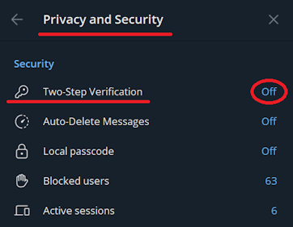
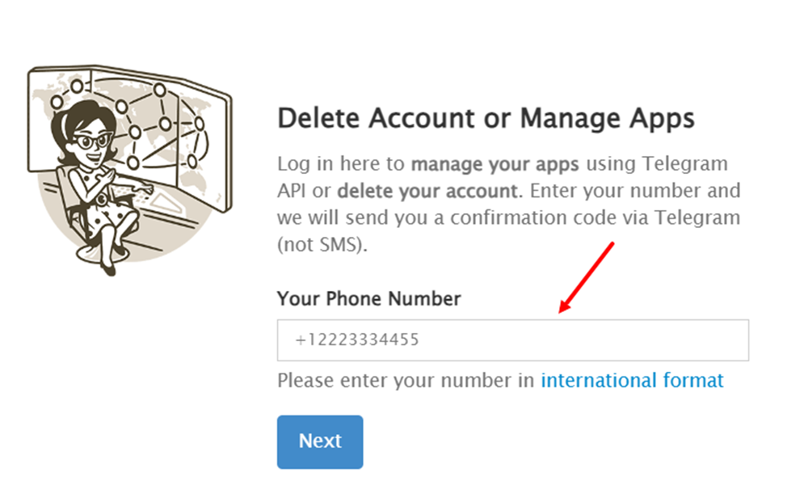
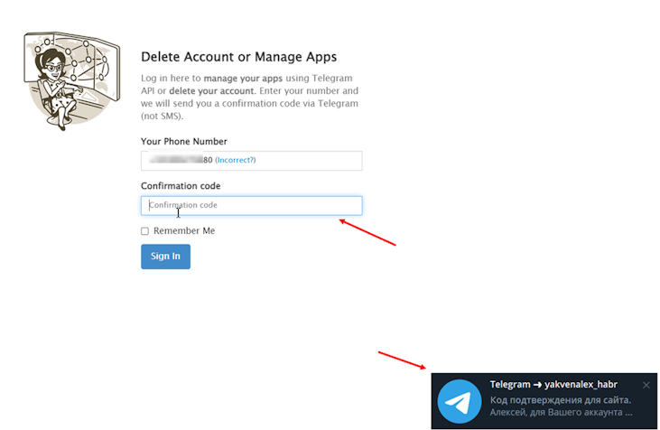
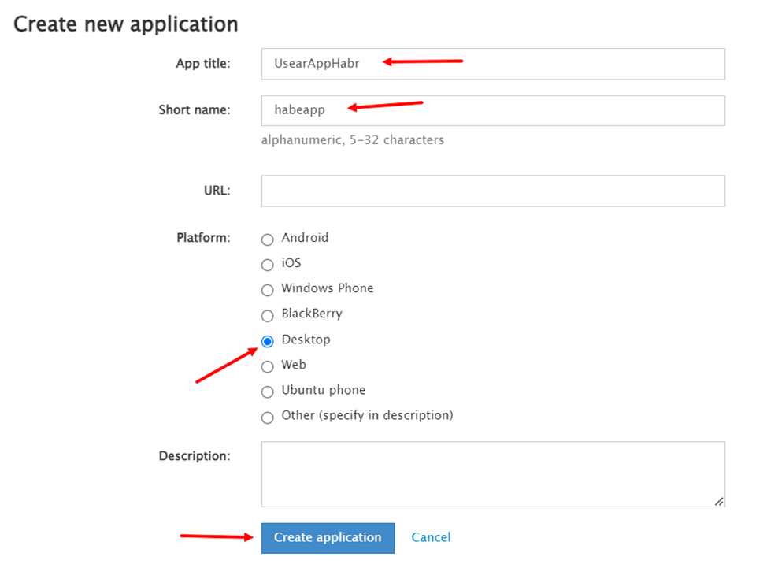

## 🌐 Available Languages
- 🇬🇧 [English](README.md)
- 🇷🇺 [Русский](README.ru.md)

## ✈️ Description
<div align="center">
  
</div>

<div align="center">
  Merge accounts and perform the same actions on them.
</div>

## 🚀 Quick Start
1. **🔐 Remove cloud-stored password**
    -  <p align="left"></p>

2. **🔑 Register your Telegram API ID**   
    -  Go to my.telegram.org/auth <br><div align="left"></div>
    -  Login to your Telegram account <br><div align="left"></div>
    -  Go to API development tools <br><div align="left"></div>
    -  Fill the fields by unique values <br><div align="left"></div>
    
## ⚙️ Building

## 🧪 Usage Example

## ❗Troubleshooting 

###  ❌ Error: 
`Failed building wheel for tgcrypto`
###  ✅ Solution:
Install TgCrypto-pyrofork by
```bash
pip install TgCrypto-pyrofork
```

## 📄 License
This project is licensed under the [GPLv3 license](LICENSE).
